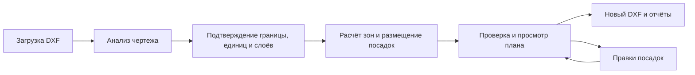

# Автосад


**Интеллектуальное планирование городского озеленения.**

Автосад принимает DXF с подосновой и коммуникациями, рассчитывает допустимые зоны
для деревьев и кустарников, создаёт план посадок и проверяет его. Результат — новый
DXF с отдельными слоями посадок, JSON-план и объяснимый отчёт в JSON/Markdown.
Исходный файл сохраняется без перезаписи.

Ниже — сценарий работы и инструкция развёртывания **всего приложения**:
веб-интерфейса, API, базы данных и фонового обработчика.

- [Демофайл, готовая конфигурация и пошаговый прогон](examples/README.md)
- [API-документация для открытия без сервера](docs/api-docs.html) · [OpenAPI JSON](docs/openapi.json)
- [Архитектура, алгоритм, API, нормативные правила и ограничения](docs/technical-overview.md)
- [PDF-документация MVP от 29.09.2026](docs/avtosad-documentation.pdf)

## Как выглядит работа с Автосадом



1. **Загрузите подоснову.** Создайте проект и добавьте DXF. Автосад анализирует
   слои, объекты, единицы и возможные границы, показывает предупреждения
   и диагностический предпросмотр слоёв.
2. **Подтвердите исходные данные.** Укажите границу расчёта и назначение слоёв:
   здания, дороги, коммуникации, существующая растительность. Задайте количества
   деревьев и кустарников и межпосадочные интервалы.
3. **Создайте план.** Python рассчитывает отдельные допустимые зоны для деревьев
   и кустарников. Алгоритмический режим доступен через API/Swagger; кнопка
   помощника в интерфейсе использует настроенную LLM для выбора композиции
   из подготовленных Python-кандидатов. Проверку результата выполняет Python.
4. **Просмотрите и скорректируйте результат.** На карте можно выбрать посадку,
   изменить её параметры, добавить или удалить растение. Правки проверяются
   сервером; перед экспортом нужна проверка актуальной ревизии плана.
5. **Скачайте комплект.** Новый DXF содержит посадки на отдельных слоях,
   короткие марки и экспликацию. Вместе с ним формируются `plan.json`,
   `report.json` и `report.md`. Исходный DXF остаётся неизменным.

Для первого знакомства используйте [синтетический пример и готовый конфиг](examples/README.md).
Он показывает участок со зданием, дорогой, сетями и существующими деревьями;
зафиксированный прогон ядра разместил 12 деревьев и 20 кустарников.
Пошаговый запуск приведён в разделе 5, устройство расчёта — в
[техническом описании](docs/technical-overview.md).

## 1. Что нужно установить

Для запуска через Docker:

- Git для получения исходного кода.
- Docker Engine с работающим daemon и Compose v2 или новее (`docker compose`).
  Для разработки на macOS можно использовать Docker Desktop.
- Доступ к интернету при первой сборке: загружаются базовые образы и зависимости.
- Браузер; для проверки экспортного DXF — отдельный CAD-просмотрщик.

Python, Poetry, Node.js и PostgreSQL на хосте для Docker-запуска **не нужны**:
Dockerfile собирает frontend и Python-окружение, Compose поднимает PostgreSQL.

Целевая среда по ТЗ — МосТех.ОС x86-64 / совместимый Linux. Ориентир ТЗ для
рабочей станции: 16 ГБ RAM, для тяжёлых чертежей — 32 ГБ; CPU от 3 ГГц,
GPU от 4 ГБ для CAD. Расчётное ядро GPU не использует. Проверка именно на
МосТех.ОС пока не зафиксирована.

Проверьте инструменты и доступность Docker:

```bash
docker --version
docker compose version
docker info
```

## 2. Получить проект и создать настройки

Клонируйте репозиторий по его адресу и перейдите в каталог проекта. Все дальнейшие
Docker-команды выполняются **из корня**, где лежат `compose.yaml` и `Dockerfile`.

```bash
git clone <URL-репозитория> avtosad
cd avtosad
cp .env.example .env
```

Замените `<URL-репозитория>` реальным адресом. Если проект уже скачан, используйте
его каталог. Копируйте `.env.example` только при первом запуске: существующий
`.env` содержит ваши настройки и ключи.

Откройте `.env` и настройте основные параметры:

| Переменная | Значение по умолчанию | Что настраивает |
|---|---|---|
| `SERVER_PORT` | `8000` | Порт интерфейса и API на хосте |
| `DB_POSTGRES_PORT` | `5432` | Порт PostgreSQL на хосте |
| `DB_POSTGRES_NAME` | `landscape_planner` | Имя базы данных |
| `DB_POSTGRES_USERNAME` | `landscape_planner` | Пользователь PostgreSQL |
| `DB_POSTGRES_PASSWORD` | `landscape_planner` | Пароль PostgreSQL; задайте свой перед первым запуском |
| `AGENT_ENABLED` | `false` | Включение помощника с LLM |
| `ALLOW_EXTERNAL_LLM` | `false` | Разрешение передачи сводок и кандидатов внешнему провайдеру |
| `MAX_UPLOAD_SIZE_BYTES` | `314572800` | Лимит исходного файла: 300 МБ |
| `MAX_ARTIFACT_SIZE_BYTES` | `524288000` | Лимит одного артефакта: 500 МБ |
| `SENTRY_DSN` | пусто | Необязательная отправка диагностических событий |

Для пароля удобно использовать длинную случайную строку из латинских букв и цифр:
текущая реализация подставляет пароль в URL подключения к БД без отдельного
URL-кодирования. Не публикуйте `.env` в репозитории.

Остальные значения можно оставить из примера. В Docker Compose автоматически
переопределяет адрес БД на `db:5432`, адрес API внутри контейнера на `0.0.0.0:8000`
и путь файлового хранилища на `/data/storage`. Поэтому `DB_POSTGRES_HOST=localhost`
в исходном `.env` не мешает Docker-запуску. Смена порта хоста не меняет эти
внутренние адреса.

Имя пользователя, пароль и имя БД применяются при **первой инициализации**
PostgreSQL. Если volume уже содержит базу, изменение этих полей в `.env`
не переименует базу и не изменит пароль существующего пользователя.

### Режим без LLM

Оставьте `AGENT_ENABLED=false` и `ALLOW_EXTERNAL_LLM=false`. Импорт, анализ,
алгоритмическая генерация, проверка и экспорт работают без внешней модели.

**Кнопка генерации в текущем UI вызывает LLM-помощника.** В этом режиме запускайте
генерацию через Swagger: `POST /api/projects/{project_id}/plans`.
Подробные действия приведены в [инструкции демо](examples/README.md).

### Режим с помощником в UI

Для работы кнопки помощника заполните в `.env`:

```dotenv
AGENT_ENABLED=true
LLM_PROVIDER=openai
LLM_MODEL=<идентификатор-доступной-модели>
LLM_API_KEY=<ключ-провайдера>
ALLOW_EXTERNAL_LLM=true
```

Подставьте действующие значения вместо `<...>`. Модель должна поддерживать
инструменты и структурированные ответы, используемые приложением.

Для OpenAI-compatible API вместо `openai` задайте:

```dotenv
LLM_PROVIDER=openai_compatible
LLM_BASE_URL=https://<адрес-сервера>/v1
```

Также нужны `AGENT_ENABLED`, `LLM_MODEL`, `LLM_API_KEY` и разрешение передачи,
указанные выше. Полный DXF модели не передаётся, но передаются необходимые сводки
и кандидаты. Включение внешнего режима означает разрешение на такую передачу.

Если модель работает на вашем компьютере, `127.0.0.1` **в контейнере** указывает
на сам контейнер, а не на хост. В Docker Desktop используйте доступный сервер
по адресу `http://host.docker.internal:<порт>/v1`. Для Docker Engine на Linux
при использовании этого имени добавьте обоим сервисам `api` и `worker`
в Compose настройку `extra_hosts: ["host.docker.internal:host-gateway"]`;
сервер модели должен принимать соединения с Docker-сети.
Текущая проверка адресов требует `ALLOW_EXTERNAL_LLM=true` и для этого имени.
Локальный сервер модели не входит в Compose и запускается отдельно.

## 3. Собрать и запустить весь проект

```bash
# Проверить конфигурацию без вывода значений секретов.
docker compose config --quiet

# Собрать общий образ для API, миграций и worker.
docker compose build api

# Запустить все основные сервисы.
docker compose up -d
```

Переходите к следующей команде только после успешного завершения предыдущей.
Явная сборка `api` создаёт общий образ `landscape-planner:local`, который также
используют `migrate` и `worker`. Отдельно запускать `npm install`, Poetry,
миграции или Vite на хосте не требуется.

| Сервис | Что делает | Ожидаемое состояние |
|---|---|---|
| `db` | PostgreSQL 16, метаданные и очередь задач | `Up`, затем `healthy` |
| `migrate` | `alembic upgrade head` перед стартом приложения | `Exited (0)` после успешной миграции |
| `api` | FastAPI и собранный React-интерфейс | `Up`, затем `healthy` |
| `worker` | Последовательная обработка CAD-задач и вызовов LLM | `Up` |

Frontend собирается на этапе Docker build и раздаётся через FastAPI.
Отдельного frontend-контейнера или порта 5173 в этом режиме нет.
`test_db` не запускается: он включён только в профиль тестирования.
Не масштабируйте `worker`: приложение рассчитано на один процесс обработчика.

## 4. Проверить готовность

```bash
docker compose ps -a
docker compose logs --tail=100 migrate api worker
curl --fail http://127.0.0.1:8000/health
curl --fail http://127.0.0.1:8000/api/projects/
```

Команды используют порт 8000; если вы поменяли `SERVER_PORT`, замените его в URL.
Дождитесь готовности `db` и `api`. `/health` проверяет доступность API;
запрос списка проектов дополнительно проверяет работу API с базой данных.
Готовность worker подтверждается успешным выполнением фоновой задачи демо.

| Адрес | Назначение |
|---|---|
| [http://127.0.0.1:8000/](http://127.0.0.1:8000/) | Интерфейс приложения, перенаправление на `/static/` |
| [http://127.0.0.1:8000/docs](http://127.0.0.1:8000/docs) | Swagger: схемы и интерактивный вызов API |
| [http://127.0.0.1:8000/openapi.json](http://127.0.0.1:8000/openapi.json) | Спецификация OpenAPI |
| [http://127.0.0.1:8000/health](http://127.0.0.1:8000/health) | Проверка доступности API |

Compose публикует порты только на `127.0.0.1`. Если приложение запущено на удалённом
Linux-сервере, открыть его на своём компьютере можно через SSH-туннель:

```bash
ssh -N -L 8000:127.0.0.1:8000 <пользователь>@<сервер>
```

После этого используйте адреса из таблицы в локальном браузере. Для изменённого
порта скорректируйте туннель. Авторизация приложения не реализована;
публичный многопользовательский хостинг требует отдельной настройки защиты.

## 5. Выполнить первый расчёт

В репозитории уже есть [демонстрационный DXF](examples/greenplan_demo.dxf)
и [готовая конфигурация](examples/greenplan_demo.config.json).

1. Создайте проект в интерфейсе и загрузите DXF.
2. Запустите анализ и дождитесь завершения задачи.
3. Настройте единицы, границу и слои по [инструкции примера](examples/README.md).
   Готовый JSON можно передать через Swagger в `PUT /api/projects/{id}/config`.
4. С настроенным LLM запустите помощника в UI; без LLM выполните
   `POST /api/projects/{id}/plans` в Swagger и дождитесь `succeeded` у задачи.
5. Просмотрите план и отчёт, затем сформируйте экспорт.
6. Скачайте `result.dxf`, `plan.json`, `report.json`, `report.md` одной ревизии.
   Проверьте DXF в CAD.

Демо рассчитывается на верхней части участка, выше дороги: **4 200 м²**.
Локальный прогон ядра с готовым конфигом дал 12 деревьев, 20 кустарников
и 96 успешных проверок. Это не заменяет проверку полного серверного экспорта.

При `needs_verification` разрешён только явно запрошенный маркированный черновик.
Геометрические нарушения блокируют любой экспорт. Поддержка полного входного
пайплайна сейчас ограничена DXF: DWF принимается API на хранение, но конвертер
не реализован. Нормативный справочник не покрывает все требования ТЗ.

## 6. Данные, остановка и обновление

Compose создаёт два постоянных volume с префиксом имени Compose-проекта:

- `postgres_data` — проекты, конфигурации, планы, очередь и метаданные файлов.
- `file_storage` — исходные DXF и экспортные артефакты.

Файлы хранятся в Docker volume, а не в каталоге `examples` на хосте.
Для резервной копии нужны **оба** volume: одна БД не содержит сами чертежи.
Снимайте согласованную копию при остановленных API и worker и сохраняйте отдельно
настройки `.env`. Не меняйте имя Compose-проекта или каталог установки случайно:
иначе Compose может подключить новые пустые volumes вместо существующих.

Остановить и затем продолжить работу без удаления данных:

```bash
docker compose stop
docker compose start
```

Удалить контейнеры и сеть, сохранив постоянные данные:

```bash
docker compose down
```

После `down` возвращайте сервисы командой `docker compose up -d`.
**Не добавляйте `-v`, если данные нужны:** этот флаг удаляет volumes.

### После изменения ключа или параметров LLM

Дождитесь завершения активных задач и пересоздайте API и worker, чтобы они прочитали
обновлённый `.env`:

```bash
docker compose up -d --no-deps --force-recreate api worker
```

Обычный `docker compose restart` не применяет изменённые переменные окружения.
Настройки LLM нужны обоим процессам: автопланирование выполняет worker.

### После обновления кода

Получите согласованную версию исходников. Дождитесь завершения задач и сохраните
резервную копию данных перед обновлением схемы БД. Выполните по порядку:

```bash
docker compose build api
docker compose stop api worker
docker compose up -d db
docker compose run --rm migrate
docker compose up -d --no-deps --force-recreate api worker
docker compose ps -a
```

Если миграция завершилась с ошибкой, **не запускайте API и worker** до её устранения.
Повторите проверки из раздела 4. Обновление файлов в `config/` также требует
пересборки образа: справочники копируются в него при сборке. Существующие снимки
конфигурации и планы неизменяемы; для новых правил сохраните новую конфигурацию
и повторите расчёт.

## Диагностика

```bash
docker compose ps -a
docker compose logs --tail=200 db migrate api worker
docker compose logs -f api worker
```

| Симптом | Что проверить |
|---|---|
| Docker недоступен | Запущен ли daemon / Docker Desktop и есть ли у текущего пользователя доступ к нему |
| `address already in use` | Освободите порт или измените `SERVER_PORT` / `DB_POSTGRES_PORT` в `.env`, затем выполните `docker compose up -d` |
| API и worker не стартуют | Состояние `db` и код завершения `migrate`; сначала устраните ошибку БД/миграции |
| PostgreSQL отклоняет пароль | Совпадают ли настройки с пользователем уже созданной БД; изменение `.env` не меняет его пароль |
| UI работает, задача остаётся `queued` | Работает ли `worker`; посмотрите его журнал и доступ к БД |
| Задача стала `failed` после перезапуска | При старте worker прерванные задачи помечаются ошибкой; после проверки входов запустите операцию повторно |
| Помощник сообщает, что отключён | Включите и настройте LLM либо используйте алгоритмический маршрут Swagger |
| Ошибка соединения с моделью | Адрес доступен из контейнера worker, модель и ключ верны, внешний режим разрешён |
| После обновления не изменился интерфейс | Пересоберите образ и пересоздайте API; frontend входит в образ |
| Экспорт недоступен | Проверьте текущую ревизию, результат Validator и полноту входных данных |

При отправке журналов исключайте ключи, пароли и закрытые данные участка.
Sentry необязателен: без `SENTRY_DSN` интеграция выключена.

## Локальная разработка без контейнеров приложения

Этот режим нужен для изменения кода. Требуются Python 3.12, Poetry 1.8.1,
Node.js 20 и PostgreSQL; БД можно оставить в Docker. Не запускайте одновременно
контейнерный и локальный worker для одной БД.

Создайте `.env` по примеру, оставьте `DB_POSTGRES_HOST=localhost` и настройте порт
для подключения с хоста. Если контейнерные API/worker уже запущены, остановите их.

```bash
docker compose stop api worker
docker compose up -d db
poetry install --no-root
poetry run alembic upgrade head
poetry run uvicorn app.main:backend_app --host 127.0.0.1 --port 8000
```

Дождитесь готовности PostgreSQL перед миграцией. В двух отдельных терминалах
из корня проекта запустите worker и frontend:

```bash
poetry run python -m app.worker
```

```bash
npm --prefix frontend ci
npm --prefix frontend run dev
```

Интерфейс разработки: [http://127.0.0.1:5173/static/](http://127.0.0.1:5173/static/).
Vite проксирует `/api` на `127.0.0.1:8000`. Production-сборка
`npm --prefix frontend run build` создаёт `app/static` для раздачи через FastAPI.

## Проверки для разработчика

### Автономная документация API

Скачайте [docs/api-docs.html](docs/api-docs.html) и откройте двойным кликом
в браузере. Страница содержит методы, параметры, тела запросов, ответы и схемы
данных; работает без сервера и интернета. На GitHub скачивайте исходный HTML
через **Download raw file**, а не сохраняйте страницу просмотра кода.
[docs/openapi.json](docs/openapi.json) можно импортировать в Postman.

После изменения API обновите оба файла из корня проекта:

```bash
poetry run python tools/export_api_docs.py
```

Команда требует установленных Python-зависимостей проекта, но не запускает
сервер, worker, миграции или подключение к БД. Использует настройки `.env`
с недостающими значениями из `.env.example`; телеметрия при экспорте отключена.
Для выполнения запросов запустите приложение и откройте `/docs`.

### Проверки кода

После установки dev-зависимостей Poetry и зависимостей frontend:

```bash
docker compose --profile test up -d test_db
poetry run pytest
poetry run ruff check app tests
poetry run ruff format --check app tests
npm --prefix frontend run build
```

Дождитесь готовности `test_db`. `TEST_DATABASE_URL` должен указывать на отдельную
тестовую БД на порту 5434: fixtures пересоздают её таблицы. Если меняли логин/пароль
в `.env`, согласуйте тестовый URL. `pytest` включает coverage с порогом 80%.

При подготовке этой инструкции выполнены `docker compose config --quiet`
и проверка списка сервисов. Сборка и запуск контейнеров заново не выполнялись;
эта инструкция не является протоколом проверки на МосТех.ОС или в CAD.
