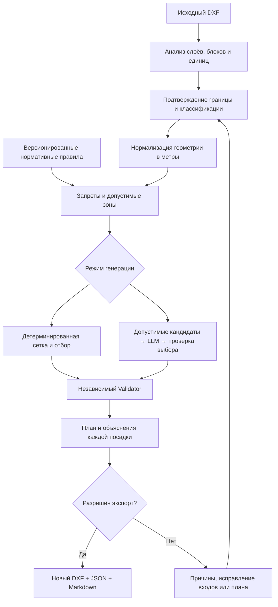

# Автосад: техническое описание

[Развёртывание проекта](../README.md) · [Демонстрационный прогон](../examples/README.md)

## Как работает алгоритм



**Подготовка.** ezdxf разбирает сущности и вложенные INSERT-блоки. Линии, полилинии,
дуги и окружности преобразуются в 2D-геометрию; кривые аппроксимируются с заданной
погрешностью. Координаты переводятся в локальные метры. Это не WGS84 и не карта
с географическими широтой и долготой. Некорректные контуры и неизвестные данные
фиксируются как проблемы, а не исправляются молча.

**Ограничения.** Для каждого классифицированного объекта выбираются применимые
правила по типу объекта, типу растения и атрибутам. Shapely строит буферы запретов
и вычитает их из границы участка. Зоны деревьев и кустарников рассчитываются
раздельно. Отсутствующее правило не трактуется как разрешение. Запись справочника
об отсутствии числового требования не превращается в выдуманный нулевой отступ.

**Алгоритмическая генерация.** `hex-grid-greedy/1` перебирает несколько смещений
гексагональной сетки. Сначала отбирает деревья, затем кустарники, соблюдая лимиты
и межпосадочные интервалы. Из вариантов выбирает лучший по количеству деревьев,
затем кустарников, с устойчивым порядком разрешения равенства. Это эвристика,
не доказательство глобального оптимума; при недостатке места возможен недобор.

**Гибридная генерация.** Python готовит допустимые кандидаты и их характеристики;
LLM выбирает композицию рядов, аллей и групп. Выбор проверяется в Python.
Повторные обращения запрашивают недостающее количество; после исчерпания попыток
Python может дополнить композицию, фиксируя такие добавления в предупреждениях.
Модель не задаёт нормативные расстояния. Внешняя LLM не гарантирует побитовую
воспроизводимость; для повторяемого расчёта предусмотрен алгоритмический режим.

**Валидация.** Независимый Validator проверяет каждую опубликованную посадку по
исходной расчётной геометрии: принадлежность границе, расстояния до объектов,
интервалы между растениями. Генерация, ручные правки и экспорт защищены
проверками прикладного слоя, независимо от UI и инструкций модели.

Реализация: [CAD](../app/cad/), [геометрия](../app/geometry/),
[генератор и Validator](../app/planning/), [помощник](../app/agent/).

## Нормы и объяснимость

Правила хранятся в [config/normative_rules.yaml](../config/normative_rules.yaml),
ассортимент — в [config/plant_catalog.yaml](../config/plant_catalog.yaml).
В текущем справочнике 13 правил с источниками по постановлению Москвы № 743-ПП,
п. 3.6.3, таблице 3.6.1; каталог содержит 248 записей. Версии, ссылки на публикации,
даты проверки и ограничения применимости записаны в самих YAML-файлах.

Это описание текущих данных репозитория, а не заявление о полном покрытии всех
норм ТЗ. СП 42.13330.2016, 623-ПП, специальные требования МГСН и весь набор охранных
зон не реализованы в полном объёме. Их применимость к сдаваемому участку нужно
проверить отдельно. Статус `verified` относится к реализованным проверкам
и подтверждённым входам, а не к согласованию проекта уполномоченным органом.

Трассировка результата:

```text
UUID посадки → проверяемый объект → фактическое / требуемое расстояние
             → правило → документ → пункт → статус и причина
```

Для каждой проверки сохраняются `planting_id`, тип и статус проверки, фактическое
и требуемое значения, единица измерения, причина и, для нормативной проверки,
идентификатор правила, документ, пункт и источник. Геометрическая принадлежность
границе и проектные межпосадочные интервалы не выдаются за нормативные пункты.
JSON-отчёт содержит также версии и SHA-256 исходника, конфигурации и справочников.

| Состояние | Что означает для экспорта |
|---|---|
| План `verified`, Validator `passed` | Доступен обычный экспорт текущей ревизии |
| `needs_verification` | Возможен явно запрошенный демонстрационный черновик |
| Геометрические нарушения / невалидный план | Экспорт блокируется, включая черновой |

После изменения конфигурации нужен новый расчёт. После правки посадок нельзя
использовать проверку старой ревизии как подтверждение новой.

## Экспорт и слои DXF

Комплект одной ревизии состоит из `result.dxf`, `plan.json`, `report.json`
и `report.md`. Для черновика имена имеют префикс `draft-`, отчёты и DXF содержат
предупреждение. Готовые файлы публикуются как неизменяемые артефакты.

| Слой | Содержимое |
|---|---|
| `GREENPLAN_TREES`, `GREENPLAN_BUSHES` | Символы деревьев и кустарников |
| `GREENPLAN_TREE_LABELS`, `GREENPLAN_BUSH_LABELS` | Короткие марки `Д-001`, `К-001` |
| `GREENPLAN_LEGEND` | Экспликация марок и пород |
| `GREENPLAN_TREE_AVAILABLE`, `GREENPLAN_BUSH_AVAILABLE` | Допустимые зоны |
| `GREENPLAN_TREE_EXCLUSION`, `GREENPLAN_BUSH_EXCLUSION` | Зоны запретов |
| `GREENPLAN_DRAFT` | Предупреждение в черновом экспорте |

Расчётные зоны по умолчанию выключены в DXF для читаемости плана. UUID, тип,
порода и марка записываются в ATTRIB блока. Символ растения не изображает размер
его кроны. Если имя слоя уже занято, создаётся уникальное имя; фактические имена
включены в `plan.json`. Префикс `GREENPLAN_` сохранён как технический идентификатор
после переименования сервиса в «Автосад».

Экспорт записывает новый файл и повторно читает его через ezdxf. Такая проверка
не заменяет визуальный просмотр в целевом CAD.

## Архитектура

```text
Браузер: React + TypeScript + OpenLayers
                 │ HTTP / OpenAPI
                 ▼
              FastAPI ───────────────► PostgreSQL
                 │                    проекты, снимки, планы, очередь
                 │                              ▲
                 ▼                              │
         Файловый volume ◄──────────── Python-worker (один процесс)
          DXF и экспорты               │
                                       ├─ ezdxf → Shapely → генератор → Validator
                                       └─ LangChain → LLM (опционально)
```

HTTP-обработчики вызывают services и repositories; расчётное ядро не зависит
от HTTP. Тяжёлые операции выполняет отдельный последовательный worker.
PostgreSQL хранит метаданные и очередь, файлы лежат в общем volume. Миграции
применяются отдельным контейнером до запуска API и worker. Redis, Celery и PostGIS
не требуются. Одновременный запуск второго worker защищён advisory lock.

| Компонент | Назначение и исходники |
|---|---|
| Python 3.12, [FastAPI](https://fastapi.tiangolo.com/), Pydantic | [HTTP API и схемы](../app/api/) |
| [PostgreSQL 16](https://www.postgresql.org/docs/16/), SQLAlchemy, asyncpg, Alembic | [Модели](../app/models/) и [миграции](../app/core/db/migrations/) |
| [ezdxf](https://ezdxf.readthedocs.io/en/stable/) | [Чтение, нормализация и экспорт CAD](../app/cad/) |
| [Shapely](https://shapely.readthedocs.io/en/stable/) | [Геометрия и зоны ограничений](../app/geometry/) |
| [LangChain](https://docs.langchain.com/oss/python/langchain/overview) | [Опциональное композиционное планирование](../app/agent/) |
| React 18, TypeScript, Vite, [OpenLayers](https://openlayers.org/) | [Веб-интерфейс](../frontend/) |

Точные зависимости зафиксированы в [poetry.lock](../poetry.lock)
и [frontend/package-lock.json](../frontend/package-lock.json).


## API

Префикс по умолчанию — `/api`; актуальные тела запросов и ответы описаны в Swagger.

| Метод и путь после `/api` | Действие |
|---|---|
| `POST /projects/` | Создать проект |
| `POST /projects/{id}/files/` | Загрузить исходник |
| `POST /projects/{id}/analyze` | Поставить анализ в очередь |
| `PUT /projects/{id}/config` | Сохранить подтверждённую конфигурацию |
| `POST /projects/{id}/plans` | Генерация без LLM |
| `POST /projects/{id}/agent/autoplan` | Генерация с помощником |
| `GET /jobs/{id}` | Статус фоновой задачи |
| `GET /projects/{id}/plans/current` | Текущий план |
| `POST /projects/{id}/plans/{plan_id}/validate` | Повторная проверка |
| `GET /projects/{id}/plans/{plan_id}/report` | Объяснимый отчёт |
| `POST /projects/{id}/plans/{plan_id}/exports` | Экспорт; `?draft=true` — явный черновик |
| `GET /projects/{id}/artifacts/{artifact_id}` | Скачать артефакт |

Долгие операции возвращают HTTP 202 и задачу. Перед правкой, повторной проверкой
и экспортом получите план, прочитайте `ETag` и передайте его в `If-Match`, например
`"1"`. Без ревизии возвращается 428; при конфликте версий — 409.


## Ограничения и эксплуатация

- Полное покрытие НПА, охранных зон, климата и почв не реализовано. Подбор по
  справочнику не доказывает агрономическую пригодность каждой посадки.
- В MVP генерируются деревья и кустарники. Газоны, травянистые покрытия,
  элементы скверов и фотореалистичные визуализации не реализованы.
- XREF, неподдерживаемые объекты, неверные единицы и неполная классификация
  требуют решения проектировщика. Большой DXF сам по себе не является готовым входом.
- Preview — диагностическая карта, не полноценный CAD. По умолчанию ограничены
  2 000 объектов, 2 000 зон и около 200 000 координат; упрощение отображения
  не меняет геометрию расчёта. Неполноту preview нужно учитывать при просмотре.
- Лимит загрузки backend по умолчанию — 300 МБ, артефакта — 500 МБ; параметры
  доступны в `.env.example`. Текущая подсказка UI «200 МБ» не совпадает с лимитом backend.
- Один worker обрабатывает задачи последовательно. Авторизация и промышленный
  многопользовательский режим не реализованы; приложение рассчитано на локальный запуск.
- Работа на МосТех.ОС и визуальная совместимость результата с целевым CAD
  должны быть проверены отдельно. Dockerfile не является подтверждением такой проверки.

Диагностика: `docker compose logs -f api worker`. Sentry опционален: без
`SENTRY_DSN` выключен; `SENTRY_ENVIRONMENT`, `SENTRY_RELEASE`, `SENTRY_ENABLE_LOGS`
и `SENTRY_TRACES_SAMPLE_RATE` заданы в `.env.example`. API и worker различаются
тегом `service`; передача тел запросов и DXF отключена конфигурацией приложения.

Логотип и [фирменное изображение](../docs/brand/avtosad-presentation.jpg)
предоставлены командой проекта.
